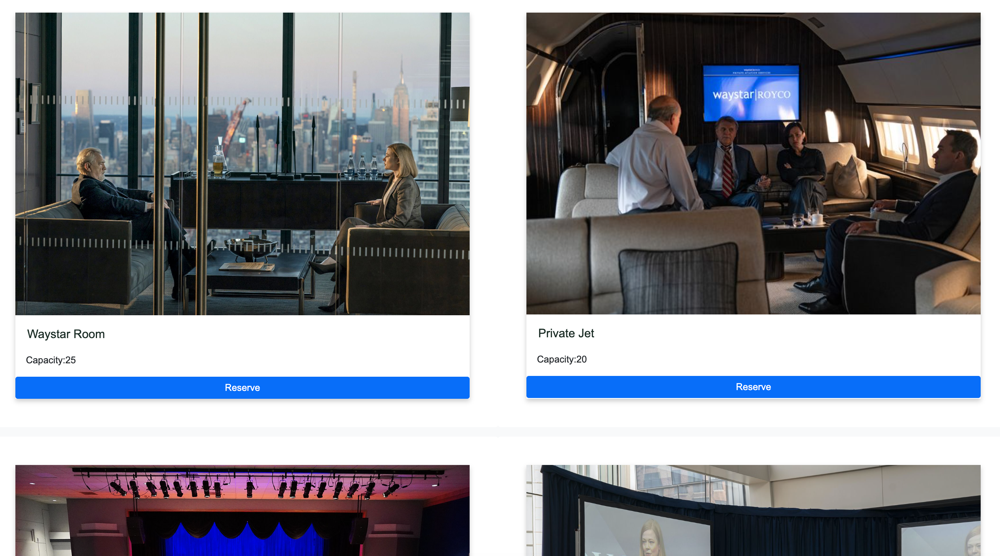
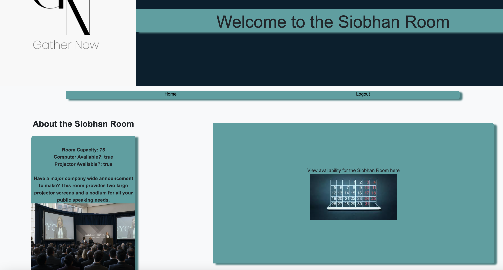
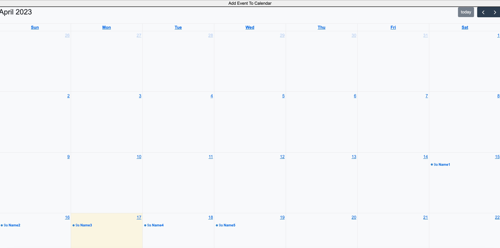

# GatherNow

## Description

This is a user friendly application that allows a user to effortlessly create their own room reservations for upcoming meetings and internal events within an organization

## Motivation

Our team wanted to create something useful that a company might need to help organize an otherwise tedious process for front desk staff

## User-Story

- As a small - mid-size company, we want a user-friendly application to help manage the logistics of employee room reservations for the spaces within our building used for meetings and events.
- As a small - mid-size company, we want an application that accepts user input to reserve dates for specific rooms or venues on the calendar.

## Installation

In order to deploy this application yourself, you first need to clone the repository. Next, make sure that you have installed the following node packages in your local repository. This will require the user to install the dependencies listed below. 
    - "bcrypt": "^5.0.0",
    - "connect-session-sequelize": "^7.1.5", 
    - "dotenv": "^16.0.3", 
    - "express": "^4.17.1",
    - "express-handlebars": "^7.0.4",
    - "express-session": "^1.17.3",
    - "fullcalendar": "^6.1.5",
    - "mysql2": "^3.2.0",
    - "sequelize": "^6.3.5",
    - "uuid": "^9.0.0"

In the command line of your local repository, run the following line of code: 
    npm install bcrypt connect-session-sequelize dotenv express express-handlebars express-session fullcalendar mysql2 sequelize uuid

## Usage

This application was deployed using Heroku.

Once a space is selected, users receive information about that space, as well as a link to the calendar

[Link to live webpage](https://boiling-mesa-08063.herokuapp.com/)

## Credits

[Mason Cox, @masonuw](https://github.com/masonuw)
[Aboubacar Drago, @Aboubacar7](https://github.com/Aboubacar7)
[Blayne Fuller @blayne-04](https://github.com/blayne-04)
[Olive Provencio-J @Olive-Provencio-Johnson](https://github.com/Olive-Provencio-Johnson)

## License

MIT License

Copyright (c) [2023] [Olive Provencio-Johnson]

Permission is hereby granted, free of charge, to any person obtaining a copy
of this software and associated documentation files (the "Software"), to deal
in the Software without restriction, including without limitation the rights
to use, copy, modify, merge, publish, distribute, sublicense, and/or sell
copies of the Software, and to permit persons to whom the Software is
furnished to do so, subject to the following conditions:

The above copyright notice and this permission notice shall be included in all
copies or substantial portions of the Software.

THE SOFTWARE IS PROVIDED "AS IS", WITHOUT WARRANTY OF ANY KIND, EXPRESS OR
IMPLIED, INCLUDING BUT NOT LIMITED TO THE WARRANTIES OF MERCHANTABILITY,
FITNESS FOR A PARTICULAR PURPOSE AND NONINFRINGEMENT. IN NO EVENT SHALL THE
AUTHORS OR COPYRIGHT HOLDERS BE LIABLE FOR ANY CLAIM, DAMAGES OR OTHER
LIABILITY, WHETHER IN AN ACTION OF CONTRACT, TORT OR OTHERWISE, ARISING FROM,
OUT OF OR IN CONNECTION WITH THE SOFTWARE OR THE USE OR OTHER DEALINGS IN THE
SOFTWARE.

